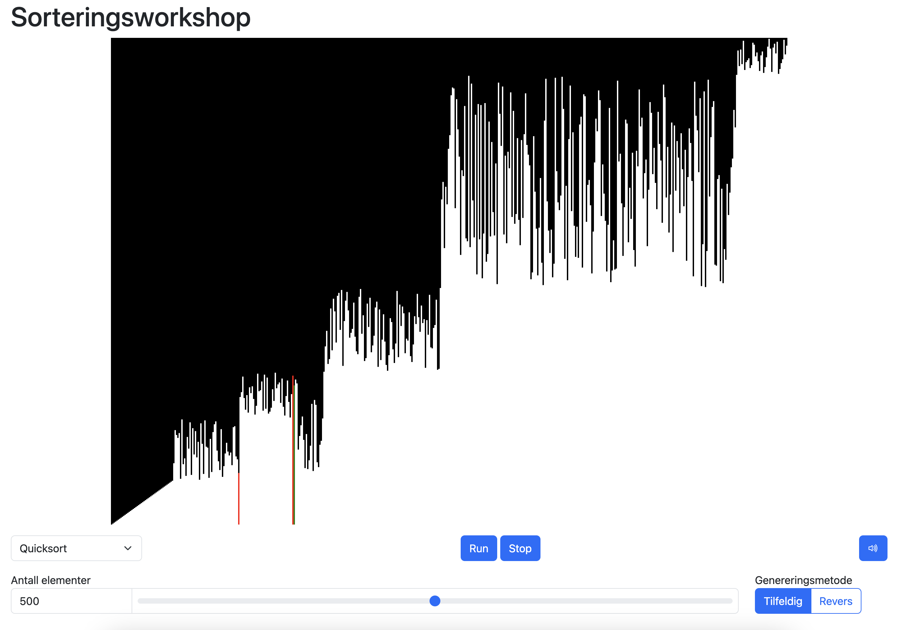

# Sorteringsworkshop



## Installasjon og oppsett

Installer det du trenger ved å kjøre

```bash
yarn install
# eller
npm install
```

Kjør igang prosjektet ved å kjøre

```bash
yarn dev
# eller
npm run dev
```

Prosjektet skal da kjøre i gang en port på localhost, og du kan se resultatet i nettleseren.
Standard port er [http://localhost:5173](http://localhost:5173).

## Skriv en algoritme

1. Opprett in fil i mappa `src/sortFunctions`

```ts
// i fila src/sortFunctions/mySortFunction.ts
import { VisualArray } from "../visualArray";

export async function mySortFunction(array: VisualArray) {
  // gjør noe med array
  // husk å awaite kall til array.get / set / swap / compare!
}
```

I `src/sortFunctions/_registerSortFunctions.ts` [(klikkbar lenke)](src/sortFunctions/_registerSortFunctions.ts), legg til sorteringsfunksjonen din med et passende navn:

```diff
  import { bubbleSort } from "./bubbleSort";
+ import { mySortFunction } from "./mySortFunction";


  export const sortFunctions = {
    "Bubble sort": bubbleSort,
+   "Min sorteringsfunksjon": mySortFunction,
 } as const;
```

Da skal den være valgbar i nettleseren!
